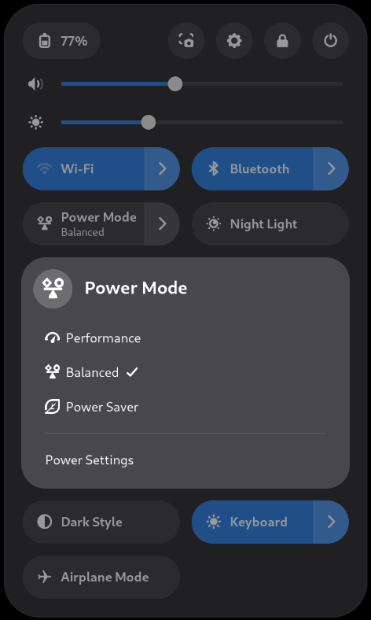
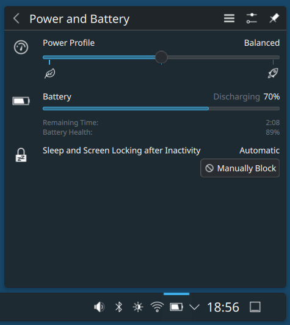
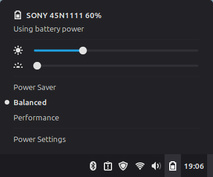

Usage
*****

Start
=====
After installation TLP will start automatically on boot. To avoid having to
restart the system the first time, you can start it manually by using the
command: ::

   sudo tlp start

.. note:: Also use this command to apply changes after editing the configuration.

Profile Switch
==============
As of version 1.9 TLP supports three profiles: *performance*, *balanced* and *power-saver*.
They can be automatically switched when changing from AC to battery power and vice versa,
or with a mouse click on your favorite desktop:

Alternatively, you can also switch using a shell command (see below).

Status
======
To verify that TLP is enabled and active use the shell command: ::

   tlp-stat -s

Check the output for

.. code-block:: none

   +++ TLP Status
   tlp            = enabled, last run: <Time of system start or last change of profile>
   tlp-rdw        = enabled
   tlp-pd         = enabled, running
   TLP profile    = balanced/BAT
   Power source   = battery

Version
=======
These shell commands show TLP's version:

*Version 1.7 and newer*
::

   tlp --version

*Version 1.6.1 and older*
::

   tlp-stat -s

See the first output line: ::

   --- TLP 1.6.1 --------------------------------------------

Commands
========

The following sections describe TLP's set of shell commands:

.. toctree::
   :maxdepth: 1

   tlp
   tlpctl
   tlp-rdw
   tlp-stat
   bluetooth, wifi, wwan <radio>
   run-on-ac, run-on-bat <run-on>

.. note::

    * All commands shown with a preceding :command:`sudo` may as well be executed
      without :command:`sudo` in a root shell
    * For even more details refer to the command's manpage: :command:`man <command>`
